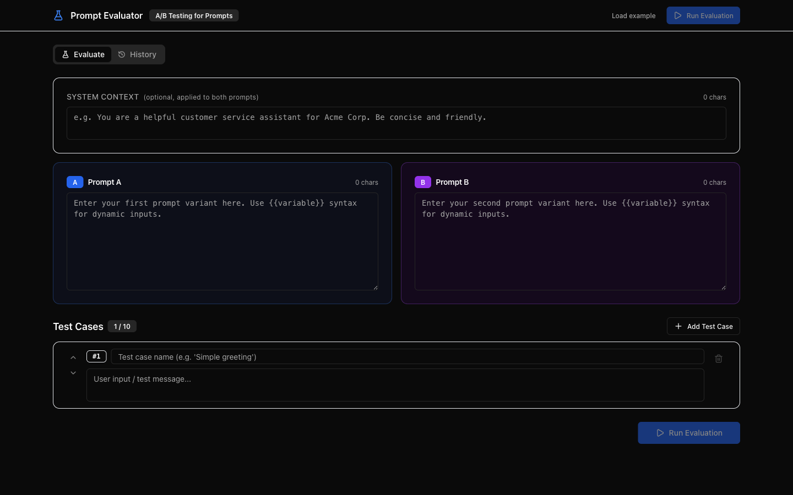
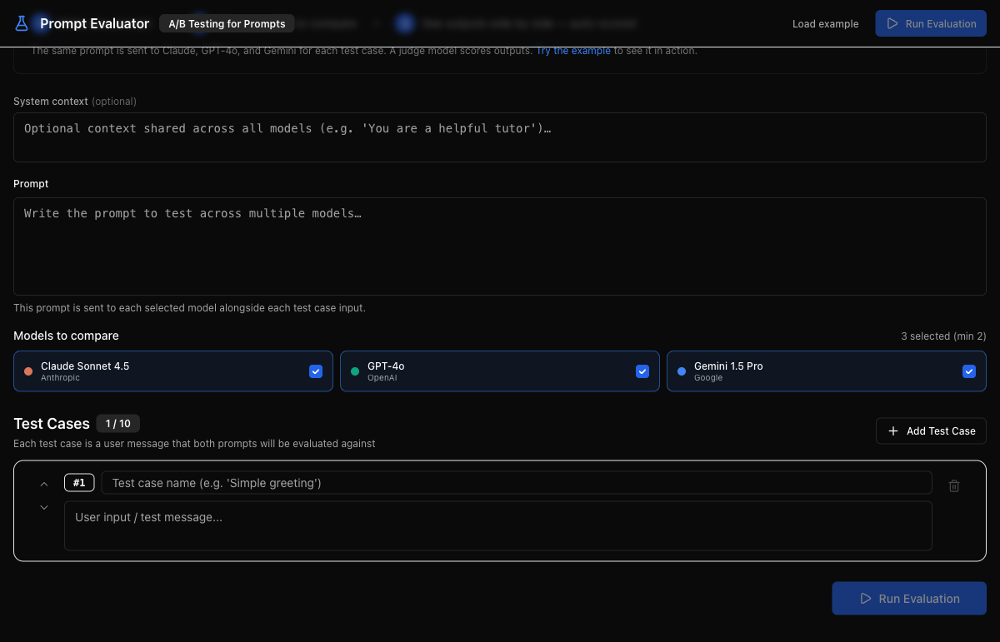

# Prompt Evaluator

**A/B test your prompts and compare models — side-by-side evaluation with auto-scored quality dimensions.**

Built for prompt engineers and product teams who want to make evidence-based decisions. Two modes: compare prompt variants against one model, or compare the same prompt across Claude, GPT-4o, and Gemini.





---

## Features

1. **Compare Prompts** — Write two prompt variants side-by-side, run them against Claude, and see which performs better
2. **Compare Models** — Write one prompt, select 2-3 models (Claude Sonnet 4.5, GPT-4o, Gemini 1.5 Pro), and compare outputs across providers
3. **Flexible test cases** — Define 1-10 test cases with names and input messages; reorder with up/down arrows; shared across both modes
4. **Streaming evaluation** — Real-time progress as each model/prompt completes, with cancellation support
5. **Auto-scoring** — A judge LLM scores each output on Relevance, Conciseness, and Accuracy (1-5 each)
6. **Evaluation history** — All runs (both modes) saved to localStorage; view, export as CSV/JSON, or delete

---

## Quick Start

```bash
# 1. Clone the repo
git clone https://github.com/cla1redonald/prompt-evaluator.git
cd prompt-evaluator

# 2. Install dependencies
npm install

# 3. Add your API key
cp .env.example .env.local
# Edit .env.local and add your API keys (Anthropic required; OpenAI/Google for Compare Models)

# 4. Run the dev server
npm run dev
```

Open [http://localhost:3000](http://localhost:3000) in your browser.

---

## How It Works

### Compare Prompts mode

Same model, different prompts — which wording produces better output?

1. **Write two prompts** — Enter Prompt A and Prompt B in side-by-side editors. Optionally add shared system context.
2. **Define test cases** — Add up to 10 input messages to evaluate against.
3. **Run** — Both prompts are sent to Claude for each test case. Results stream back in real time.
4. **Compare** — Side-by-side outputs with latency, token counts, auto-scores, and manual ratings.

### Compare Models mode

Same prompt, different models — which provider gives you the best output?

1. **Write one prompt** — Single editor with optional system context.
2. **Select models** — Pick 2-3 from Claude Sonnet 4.5, GPT-4o, and Gemini 1.5 Pro.
3. **Run** — The prompt is sent to all selected models for each test case, in parallel.
4. **Compare** — N-column results grid with per-model latency, tokens, and auto-scores.

---

## Auto-Scoring

After evaluation completes, a second LLM call scores each output on three dimensions:

| Dimension | What it measures | Scale |
|-----------|-----------------|-------|
| **Relevance** | How well the output addresses the input | 1-5 |
| **Conciseness** | Whether the length is appropriate (not too verbose, not too brief) | 1-5 |
| **Accuracy** | How accurate and well-grounded the information appears | 1-5 |

Scores are combined to determine a winner per test case. You can also override with manual thumbs up/down ratings.

The judge uses `claude-sonnet-4-5-20250929` with a structured scoring prompt that returns JSON. Scores are clamped to 1-5 and displayed inline in the results grid.

---

## Why I Built This

Prompt engineering is one of the most underrated product skills in the AI era. Small wording changes — being more directive, adding examples, adjusting tone — can dramatically change output quality. But without a structured way to compare variants, most teams make these decisions based on vibes and a handful of manual tests.

I wanted a tool that brings the rigor of A/B testing to prompt development: define your test cases, run both variants, see the data. The auto-scoring feature means you don't have to manually review every output — you get a signal immediately, even if it's imperfect.

This is the kind of tool I wished existed when working on AI product features and spending hours in a notebook trying to decide which system prompt was better.

---

## Tech Stack

| Layer | Technology |
|-------|-----------|
| Framework | Next.js 14 (App Router) |
| Language | TypeScript |
| Styling | Tailwind CSS + shadcn/ui |
| LLMs | Claude Sonnet 4.5, GPT-4o, Gemini 1.5 Pro |
| Testing | Vitest |
| Storage | localStorage (client-side) |
| Deployment | Vercel |

---

## Project Structure

```
src/
  app/
    page.tsx              Main evaluation page
    layout.tsx            Root layout
    api/
      evaluate/route.ts         Compare Prompts endpoint (SSE)
      evaluate-models/route.ts  Compare Models endpoint (SSE, multi-provider)
      judge/route.ts            Auto-scoring endpoint
  components/
    PromptEditor.tsx            Side-by-side prompt editors (Compare Prompts)
    SinglePromptEditor.tsx      Single prompt editor (Compare Models)
    ModelSelector.tsx           Model checkbox selector
    TestCaseList.tsx             Test case management (shared)
    ResultsGrid.tsx              Prompt comparison results
    ModelResultsGrid.tsx         Model comparison results (N-column)
    ResultCell.tsx               Individual result with scores
    HistoryPanel.tsx             Evaluation history (both modes)
    ExportButton.tsx             CSV/JSON export
  lib/
    types.ts                    TypeScript interfaces + type guards + validation
    storage.ts                  localStorage wrapper
    export.ts                   CSV/JSON export utilities
    rate-limit.ts               In-memory rate limiting (5 req/min per IP)
  hooks/
    useEvaluation.ts            Compare Prompts state + SSE
    useModelEvaluation.ts       Compare Models state + SSE
    useHistory.ts               History CRUD
tests/                          126 tests across 6 files
```

---

## Development

```bash
npm run dev      # Start dev server
npm test         # Run tests (126 tests via Vitest)
npm run build    # Production build
npm run lint     # Lint check
```

---

## License

MIT
